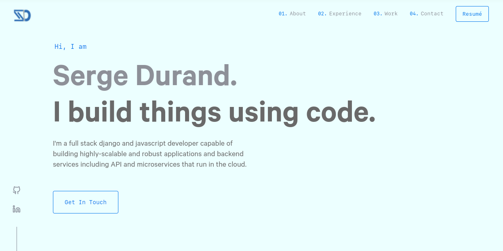

<h1 align="center">Web Portfolio</h1>

  
  
  
  
  

> The first iteration of my personal website. This project is a modified version of the original one created and designed by [Brittany Chiang](https://github.com/bchiang7/v4).

  

## ✨ Features

Visit the portfolio at [amandanas.netlify.app](https://amandanas.netlify.app/)

- You can see my work experiences and skills.
- You can see my featured and archived projects.
- You can contact me through the website.
- You can download my resumé.

Give a ⭐️ if you loved this version of the project!

## 🛠 Built With

- [Gatsby React](https://www.gatsbyjs.com/) - Frontend
- [Brittany Chiang](https://github.com/bchiang7/v4) - Theme Template
- [Anime.js](https://animejs.com/) - Animations

## 🚀 Get Started

This project was forked from Brittany Chiang's [v4 Portfolio](https://github.com/bchiang7/v4).

Below is a guide on the common commands you might use all throughout the development process. In the project directory, you can run:

#### `yarn install`

Installs all package dependencies of the app. Make sure you have [yarn](https://yarnpkg.com/) installed and configured first.

#### `yarn develop`

Runs the app in development mode. Open [http://localhost:8000](http://localhost:8000) to view it in the browser. The page will reload if you make edits. You will also see any lint errors in the console.

#### `yarn format`

Launches the linter and prettier formatter against all of the `.js` and `.jsx` files from the `src/` directory. The project specifically uses [ESLint](https://eslint.org/) and [Prettier](https://prettier.io/) as the linter and code formatter, respectively.

## 📝 License

Copyright © 2018 [Brittany Chiang](https://github.com/bchiang7). 
This project is [MIT](https://github.com/amndns/web-portfolio/blob/master/LICENSE) licensed.

***
_This README was generated with ❤️ by [readme-md-generator](https://github.com/kefranabg/readme-md-generator)_